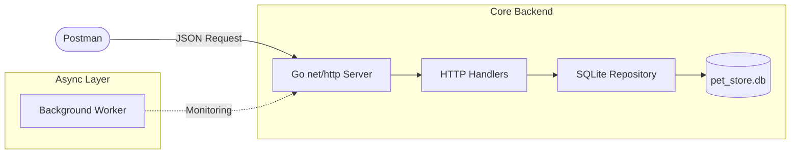

#  Pet Store API - Milestone 2 (Core System Implementation)

This project is a core backend implementation for a Pet Store management system, built with Go and SQLite.

##  Team: DNA
*   **Nurzhaina Kuralbay** - Project Manager (Git Workflow, Planning)
*   **Araizhan Tazhimova** - System Architect (ERD & Data Consistency)
*   **Damir Sheneussizov** - Backend Developer (Go & SQL Implementation)

---

##  Compliance with Grading Rubric

### 1. Backend Application 
-  **Framework:** Built using standard `net/http` library.
-  **Endpoints:** Implemented 4 working endpoints:
    - `GET /pets` (Retrieve data)
    - `POST /pets` (Create data)
    - `GET /orders` (Order tracking)
    - `POST /register` (User entry)
- **JSON:** All inputs/outputs are in JSON format.
- **Startup:** Running `go run .` starts the server on port 8080.

### 2. Data Model & Storage 
-  **ERD Consistency:** Database schema (SQLite) strictly follows the ERD from Assignment 3.
-  **CRUD:** Implemented Create and Read operations for the `Pet` entity.
-  **Persistence:** All data is saved in `pet_store.db`, ensuring it remains after server restarts.
-  **Safe Access:** Database interactions are handled through a Repository pattern.

### 3. Concurrency 
-  **Goroutine:** A background worker is implemented using a `goroutine` and `time.Ticker` in `main.go`.
-  **Purpose:** Every 30 seconds, the background process logs the system health and DB status to the console without blocking the main thread.

### 4. Git Workflow 
-  **Collaboration:** Each team member worked on separate feature branches (e.g., `feature/database`, `feature/api-handlers`).
-  **Contributions:** Each member has at least 2 meaningful commits.

### 5. Demo & Explanation
-  **Ready for Defense:** System is ready to be demonstrated via Postman.

---

##  System Architecture "Mockup"

## Data Mapping (ERD Implementation)
Entity	Fields	Type	Description
Pet	ID, Name, Category, Price, Status	SQLite	Core inventory entity
User	ID, Username, Email, Password	SQLite	Customer/Admin entity
Order	ID, PetID, UserID, Total	SQLite	Business transaction entity
## Installation & Running
#### Clone & Setup:

git clone <repo_url>

cd Pet_Store-Advanced-Programming

#### Run:
go run .

#### Test with Postman:
GET http://localhost:8080/pets
POST http://localhost:8080/pets with JSON: {"name": "Buddy", "category": "Dog", "price": 200, "status": "available"}

## Project Structure
code
Text
Pet_Store/
├── main.go               # Entry point, DB init, Goroutine worker
├── pet_store.db          # SQLite persistent storage
├── internal/
│   ├── models/           # Data structs (Pet, User, Order)
│   ├── repository/       # Database CRUD operations
│   └── handlers/         # HTTP Logic & JSON Processing
└── docs/                 # Original diagrams from Assignment 3

## Future plan: for FINAL PROJECT

#### Project will include functions:
1) Veterinarian(Appintments)
2) Product
3) Shelter

#### Role-Based Access (User & Admin)
- *User*: can view pets and products, book veterinary appointments, place orders, and see their own history.

- *Admin*: has access to an admin panel where they can manage pets and products, view all bookings, update their status, and see basic statistics.

##### Access to admin functionality will be restricted by user role.